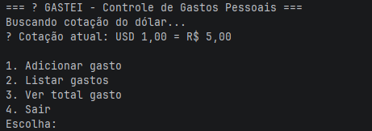
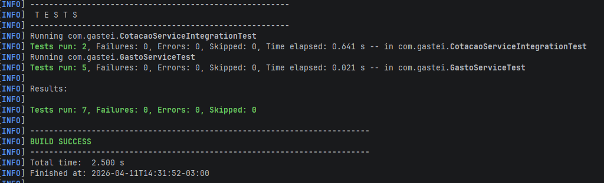

# 💸 Gastei — Controle de Gastos Pessoais


[](https://joaopaulo4111.github.io/gastei)

🌐 **Aplicação publicada:** https://joaopaulo4111.github.io/gastei

## 📋 Problema Real
Muitas pessoas têm dificuldade em controlar seus gastos diários, o que leva a
desequilíbrios financeiros ao final do mês. A falta de registro simples e acessível
contribui para o endividamento e a desorganização financeira.

## 💡 Solução
Aplicação CLI simples que permite registrar, listar e totalizar gastos pessoais,
salvando os dados localmente em arquivo JSON.

## 👥 Público-alvo
Qualquer pessoa que queira controlar gastos de forma rápida e sem complicação,
especialmente jovens e estudantes que estão aprendendo a organizar as finanças.

## ✅ Funcionalidades
- Adicionar gasto (descrição, valor, categoria)
- Listar todos os gastos registrados
- Ver o total gasto
- Persistência local em arquivo JSON

## 🛠️ Tecnologias
- Java 21
- Maven 3.9+
- Gson 2.10.1
- JUnit Jupiter 5.10.0
- Checkstyle (linting)
- GitHub Actions (CI)

## ⚙️ Pré-requisitos
- Java 21 instalado
- Maven 3.9+ instalado

## 📦 Instalação

```bash
git clone https://github.com/joaopaulo4111/gastei.git
cd gastei
mvn compile
```

## ▶️ Como executar

```bash
mvn exec:java "-Dexec.mainClass=com.gastei.Main"
```

## 🧪 Rodar os testes

```bash
mvn test
```

## 🔍 Rodar o lint (Checkstyle)

```bash
mvn checkstyle:check
```
## 📸 Evidências de Funcionamento

### ▶️ Aplicação rodando


### ✅ Testes passando


## 📌 Versão
1.0.0

## 👤 Autor
João Paulo Castro dos Santos

## 🔗 Repositório
https://github.com/joaopaulo4111/gastei